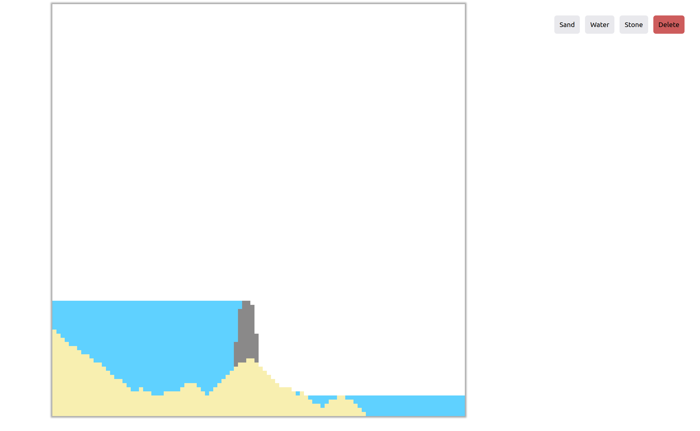

# Falling Sandbox
This is a simple and extensible implementation of a 
[falling sand](https://en.wikipedia.org/wiki/Falling-sand_game) 
[cellular automata](https://en.wikipedia.org/wiki/Cellular_automaton) 
written in Rust.

[Live Web Demo](https://dannyxy0.github.io/fallingsandbox/)

> [!WARNING]
> The web demo stutters on Firefox because of their GC implementation

## Running locally
### Standalone Executable
To run this project as a standalone executable run ``cargo run`` in the ``wgpu_render/`` directory. 

### Web Version
To compile this project to wasm install wasm-pack with ``cargo install wasm-pack`` and run ``wasm-pack build -t web``
in the ``wgpu_render/`` directory.
